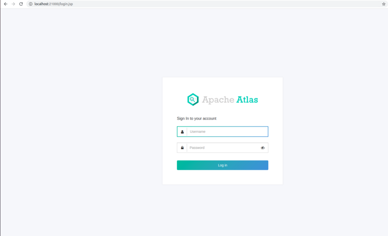
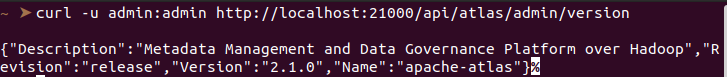

# Apache Atlas 3.0.0 Snapshot

I've been struggling with building and installing Apache Atlas 3.0.0 snapshot for weeks. In this article I want to share my experience and errors I faced to them briefly and help any other people having the same issues.

The main problem with Apache Atlas is with their official documentation which is available [here](https://atlas.apache.org/#/). I have downloaded `Apache Atlas 3.0.0 snapshot` version and did the following items as it is said in the documentation, but it didn't work properly:

1. git clone https://github.com/apache/atlas
2. cd atlas
3. export MAVEN_OPTS="-Xms2g -Xmx2g"
4. mvn clean -DskipTests package -Pdist,embedded-hbase-solr
5. cd distro/target
6. tar -xzvf apache-atlas-3.0.0-SNAPSHOT-server.tar.gz
7. apache-atlas-3.0.0-SNAPSHOT
8. export MANAGE_LOCAL_HBASE=true
9. export MANAGE_LOCAL_SOLR=true
10. bin/atlas_start.py

After doing all of above steps sequentially, I got this log:

```
configured for local hbase.
hbase started.
configured for local solr.
solr.xml doesn't exist in /bigdata/atlas/distro/target/apache-atlas-3.0.0-SNAPSHOT/data/solr, copying from /bigdata/atlas/distro/target/apache-atlas-3.0.0-SNAPSHOT/solr/server/solr/solr.xml
solr started.
setting up solr collections...
starting atlas on host localhost
starting atlas on port 21000

Apache Atlas Server started!!!
```

It seems that everything working fine. In order to check whether it works properly or not, you execute curl command or simply see http://localhost:21000 in your browser.

curl command: (the default username and password of Apache Atlas are admin.

```bash
curl -u admin:admin http://localhost:21000/api/atlas/v2/types/typedefs/head
```

After executing this command, I got `503 Service Unavailable` error.

```
<html>
<head>
<meta http-equiv="Content-Type" content="text/html;charset=utf-8"/>
<title>Error 503 Service Unavailable</title>
</head>
<body><h2>HTTP ERROR 503 Service Unavailable</h2>
<table>
<tr><th>URI:</th><td>/api/atlas/v2/types/typedefs/head</td></tr>
<tr><th>STATUS:</th><td>503</td></tr>
<tr><th>MESSAGE:</th><td>Service Unavailable</td></tr>
<tr><th>SERVLET:</th><td>-</td></tr>
</table>
<hr><a href="http://eclipse.org/jetty">Powered by Jetty:// 9.4.31.v20200723</a><hr/>

</body>
</html>
```

After checking the `application.log` in logs directory, I have seen this file and understand that zookeeper instance doesn't work properly.

```
2021-03-13 17:05:37,484 INFO  - [main:] ~ Loading atlas-application.properties from file:/bigdata/atlas/distro/target/apache-atlas-3.0.0-SNAPSHOT/conf/atlas-application.properties (ApplicationProperties:137)
2021-03-13 17:05:37,503 INFO  - [main:] ~ Using graphdb backend 'janus' (ApplicationProperties:317)
2021-03-13 17:05:37,503 INFO  - [main:] ~ Using storage backend 'hbase2' (ApplicationProperties:328)
2021-03-13 17:05:37,503 INFO  - [main:] ~ Using index backend 'solr' (ApplicationProperties:339)
2021-03-13 17:05:37,515 INFO  - [main:] ~ Atlas is running in MODE: PROD. (ApplicationProperties:343)
2021-03-13 17:05:37,516 INFO  - [main:] ~ Setting solr-wait-searcher property 'true' (ApplicationProperties:349)
2021-03-13 17:05:37,516 INFO  - [main:] ~ Setting index.search.map-name property 'false' (ApplicationProperties:353)
2021-03-13 17:05:37,516 INFO  - [main:] ~ Setting atlas.graph.index.search.max-result-set-size = 150 (ApplicationProperties:363)
2021-03-13 17:05:37,517 INFO  - [main:] ~ Property (set to default) atlas.graph.cache.db-cache = true (ApplicationProperties:375)
2021-03-13 17:05:37,517 INFO  - [main:] ~ Property (set to default) atlas.graph.cache.db-cache-clean-wait = 20 (ApplicationProperties:375)
2021-03-13 17:05:37,517 INFO  - [main:] ~ Property (set to default) atlas.graph.cache.db-cache-size = 0.5 (ApplicationProperties:375)
2021-03-13 17:05:37,517 INFO  - [main:] ~ Property (set to default) atlas.graph.cache.tx-cache-size = 15000 (ApplicationProperties:375)
2021-03-13 17:05:37,518 INFO  - [main:] ~ Property (set to default) atlas.graph.cache.tx-dirty-size = 120 (ApplicationProperties:375)
2021-03-13 17:05:37,535 INFO  - [main:] ~ 
########################################################################################
                               Atlas Server (STARTUP)

    project.name:   apache-atlas
    project.description:    Metadata Management and Data Governance Platform over Hadoop
    build.user: root
    build.epoch:    1615641603895
    project.version:    3.0.0-SNAPSHOT
    build.version:  3.0.0-SNAPSHOT
    vc.revision:    7eab2cb8d53ca4c86366e896119a1d7906ccb5b3
    vc.source.url:  scm:git:git://git.apache.org/atlas.git/atlas-webapp
######################################################################################## (Atlas:215)
2021-03-13 17:05:37,535 INFO  - [main:] ~ >>>>>>>>>>>>>>>>>>>>>>>>>>>>>>>>> (Atlas:216)
2021-03-13 17:05:37,535 INFO  - [main:] ~ Server starting with TLS ? false on port 21000 (Atlas:217)
2021-03-13 17:05:37,538 INFO  - [main:] ~ <<<<<<<<<<<<<<<<<<<<<<<<<<<<<<<<< (Atlas:218)
2021-03-13 17:05:39,801 INFO  - [main:] ~ No authentication method configured.  Defaulting to simple authentication (LoginProcessor:102)
2021-03-13 17:05:40,136 WARN  - [main:] ~ Unable to load native-hadoop library for your platform... using builtin-java classes where applicable (NativeCodeLoader:60)
2021-03-13 17:05:40,351 INFO  - [main:] ~ Logged in user root (auth:SIMPLE) (LoginProcessor:77)
2021-03-13 17:05:41,716 INFO  - [main:] ~ Not running setup per configuration atlas.server.run.setup.on.start. (SetupSteps$SetupRequired:189)
2021-03-13 17:05:43,892 WARN  - [ReadOnlyZKClient-localhost:2181@0x39acd1f1:] ~ 0x39acd1f1 to localhost:2181 failed for get of /hbase/hbaseid, code = CONNECTIONLOSS, retries = 1 (ReadOnlyZKClient$ZKTask$1:192)
2021-03-13 17:05:44,989 WARN  - [ReadOnlyZKClient-localhost:2181@0x39acd1f1:] ~ 0x39acd1f1 to localhost:2181 failed for get of /hbase/hbaseid, code = CONNECTIONLOSS, retries = 2 (ReadOnlyZKClient$ZKTask$1:192)
2021-03-13 17:05:46,092 WARN  - [ReadOnlyZKClient-localhost:2181@0x39acd1f1:] ~ 0x39acd1f1 to localhost:2181 failed for get of /hbase/hbaseid, code = CONNECTIONLOSS, retries = 3 (ReadOnlyZKClient$ZKTask$1:192)
2021-03-13 17:05:47,194 WARN  - [ReadOnlyZKClient-localhost:2181@0x39acd1f1:] ~ 0x39acd1f1 to localhost:2181 failed for get of /hbase/hbaseid, code = CONNECTIONLOSS, retries = 4 (ReadOnlyZKClient$ZKTask$1:192)
2021-03-13 17:05:48,295 WARN  - [ReadOnlyZKClient-localhost:2181@0x39acd1f1:] ~ 0x39acd1f1 to localhost:2181 failed for get of /hbase/hbaseid, code = CONNECTIONLOSS, retries = 5 (ReadOnlyZKClient$ZKTask$1:192)
2021-03-13 17:05:49,397 WARN  - [ReadOnlyZKClient-localhost:2181@0x39acd1f1:] ~ 0x39acd1f1 to localhost:2181 failed for get of /hbase/hbaseid, code = CONNECTIONLOSS, retries = 6 (ReadOnlyZKClient$ZKTask$1:192)
2021-03-13 17:05:50,499 WARN  - [ReadOnlyZKClient-localhost:2181@0x39acd1f1:] ~ 0x39acd1f1 to localhost:2181 failed for get of /hbase/hbaseid, code = CONNECTIONLOSS, retries = 7 (ReadOnlyZKClient$ZKTask$1:192)
2021-03-13 17:05:51,601 WARN  - [ReadOnlyZKClient-localhost:2181@0x39acd1f1:] ~ 0x39acd1f1 to localhost:2181 failed for get of /hbase/hbaseid, code = CONNECTIONLOSS, retries = 8 (ReadOnlyZKClient$ZKTask$1:192)
2021-03-13 17:05:52,703 WARN  - [ReadOnlyZKClient-localhost:2181@0x39acd1f1:] ~ 0x39acd1f1 to localhost:2181 failed for get of /hbase/hbaseid, code = CONNECTIONLOSS, retries = 9 (ReadOnlyZKClient$ZKTask$1:192)
2021-03-13 17:05:53,805 WARN  - [ReadOnlyZKClient-localhost:2181@0x39acd1f1:] ~ 0x39acd1f1 to localhost:2181 failed for get of /hbase/hbaseid, code = CONNECTIONLOSS, retries = 10 (ReadOnlyZKClient$ZKTask$1:192)
2021-03-13 17:05:54,907 WARN  - [ReadOnlyZKClient-localhost:2181@0x39acd1f1:] ~ 0x39acd1f1 to localhost:2181 failed for get of /hbase/hbaseid, code = CONNECTIONLOSS, retries = 11 (ReadOnlyZKClient$ZKTask$1:192)
2021-03-13 17:05:56,009 WARN  - [ReadOnlyZKClient-localhost:2181@0x39acd1f1:] ~ 0x39acd1f1 to localhost:2181 failed for get of /hbase/hbaseid, code = CONNECTIONLOSS, retries = 12 (ReadOnlyZKClient$ZKTask$1:192)
2021-03-13 17:05:57,110 WARN  - [ReadOnlyZKClient-localhost:2181@0x39acd1f1:] ~ 0x39acd1f1 to localhost:2181 failed for get of /hbase/hbaseid, code = CONNECTIONLOSS, retries = 13 (ReadOnlyZKClient$ZKTask$1:192)
2021-03-13 17:05:58,212 WARN  - [ReadOnlyZKClient-localhost:2181@0x39acd1f1:] ~ 0x39acd1f1 to localhost:2181 failed for get of /hbase/hbaseid, code = CONNECTIONLOSS, retries = 14 (ReadOnlyZKClient$ZKTask$1:192)
2021-03-13 17:05:59,313 WARN  - [ReadOnlyZKClient-localhost:2181@0x39acd1f1:] ~ 0x39acd1f1 to localhost:2181 failed for get of /hbase/hbaseid, code = CONNECTIONLOSS, retries = 15 (ReadOnlyZKClient$ZKTask$1:192)
2021-03-13 17:06:00,414 WARN  - [ReadOnlyZKClient-localhost:2181@0x39acd1f1:] ~ 0x39acd1f1 to localhost:2181 failed for get of /hbase/hbaseid, code = CONNECTIONLOSS, retries = 16 (ReadOnlyZKClient$ZKTask$1:192)
2021-03-13 17:06:01,517 WARN  - [ReadOnlyZKClient-localhost:2181@0x39acd1f1:] ~ 0x39acd1f1 to localhost:2181 failed for get of /hbase/hbaseid, code = CONNECTIONLOSS, retries = 17 (ReadOnlyZKClient$ZKTask$1:192)
2021-03-13 17:06:02,618 WARN  - [ReadOnlyZKClient-localhost:2181@0x39acd1f1:] ~ 0x39acd1f1 to localhost:2181 failed for get of /hbase/hbaseid, code = CONNECTIONLOSS, retries = 18 (ReadOnlyZKClient$ZKTask$1:192)
2021-03-13 17:06:03,720 WARN  - [ReadOnlyZKClient-localhost:2181@0x39acd1f1:] ~ 0x39acd1f1 to localhost:2181 failed for get of /hbase/hbaseid, code = CONNECTIONLOSS, retries = 19 (ReadOnlyZKClient$ZKTask$1:192)
2021-03-13 17:06:04,822 WARN  - [ReadOnlyZKClient-localhost:2181@0x39acd1f1:] ~ 0x39acd1f1 to localhost:2181 failed for get of /hbase/hbaseid, code = CONNECTIONLOSS, retries = 20 (ReadOnlyZKClient$ZKTask$1:192)
2021-03-13 17:06:16,941 WARN  - [ReadOnlyZKClient-localhost:2181@0x39acd1f1:] ~ 0x39acd1f1 to localhost:2181 failed for get of /hbase/hbaseid, code = CONNECTIONLOSS, retries = 30, give up (ReadOnlyZKClient$ZKTask$1:196)
2021-03-13 17:06:16,958 WARN  - [main:] ~ Retrieve cluster id failed (ConnectionImplementation:576)
java.util.concurrent.ExecutionException: org.apache.zookeeper.KeeperException$ConnectionLossException: KeeperErrorCode = ConnectionLoss for /hbase/hbaseid
    at java.base/java.util.concurrent.CompletableFuture.reportGet(CompletableFuture.java:395)
    at java.base/java.util.concurrent.CompletableFuture.get(CompletableFuture.java:1999)
    at org.apache.hadoop.hbase.client.ConnectionImplementation.retrieveClusterId(ConnectionImplementation.java:574)
    at org.apache.hadoop.hbase.client.ConnectionImplementation.<init>(ConnectionImplementation.java:307)
    at java.base/jdk.internal.reflect.NativeConstructorAccessorImpl.newInstance0(Native Method)
    at java.base/jdk.internal.reflect.NativeConstructorAccessorImpl.newInstance(NativeConstructorAccessorImpl.java:62)
    at java.base/jdk.internal.reflect.DelegatingConstructorAccessorImpl.newInstance(DelegatingConstructorAccessorImpl.java:45)
    at java.base/java.lang.reflect.Constructor.newInstance(Constructor.java:490)
    at org.apache.hadoop.hbase.client.ConnectionFactory.lambda$createConnection$0(ConnectionFactory.java:230)
    at java.base/java.security.AccessController.doPrivileged(Native Method)
    at java.base/javax.security.auth.Subject.doAs(Subject.java:423)
    at org.apache.hadoop.security.UserGroupInformation.doAs(UserGroupInformation.java:1729)
    at org.apache.hadoop.hbase.security.User$SecureHadoopUser.runAs(User.java:347)
    at org.apache.hadoop.hbase.client.ConnectionFactory.createConnection(ConnectionFactory.java:228)
    at org.apache.hadoop.hbase.client.ConnectionFactory.createConnection(ConnectionFactory.java:128)
    at org.janusgraph.diskstorage.hbase2.HBaseCompat2_0.createConnection(HBaseCompat2_0.java:46)
    at org.janusgraph.diskstorage.hbase2.HBaseStoreManager.<init>(HBaseStoreManager.java:314)
    at java.base/jdk.internal.reflect.NativeConstructorAccessorImpl.newInstance0(Native Method)
    at java.base/jdk.internal.reflect.NativeConstructorAccessorImpl.newInstance(NativeConstructorAccessorImpl.java:62)
    at java.base/jdk.internal.reflect.DelegatingConstructorAccessorImpl.newInstance(DelegatingConstructorAccessorImpl.java:45)
    at java.base/java.lang.reflect.Constructor.newInstance(Constructor.java:490)
    at org.janusgraph.util.system.ConfigurationUtil.instantiate(ConfigurationUtil.java:58)
    at org.janusgraph.diskstorage.Backend.getImplementationClass(Backend.java:440)
    at org.janusgraph.diskstorage.Backend.getStorageManager(Backend.java:411)
    at org.janusgraph.graphdb.configuration.builder.GraphDatabaseConfigurationBuilder.build(GraphDatabaseConfigurationBuilder.java:50)
    at org.janusgraph.core.JanusGraphFactory.open(JanusGraphFactory.java:161)
    at org.janusgraph.core.JanusGraphFactory.open(JanusGraphFactory.java:132)
    at org.janusgraph.core.JanusGraphFactory.open(JanusGraphFactory.java:112)
    at org.apache.atlas.repository.graphdb.janus.AtlasJanusGraphDatabase.initJanusGraph(AtlasJanusGraphDatabase.java:182)
    at org.apache.atlas.repository.graphdb.janus.AtlasJanusGraphDatabase.getGraphInstance(AtlasJanusGraphDatabase.java:169)
    at org.apache.atlas.repository.graphdb.janus.AtlasJanusGraphDatabase.getGraph(AtlasJanusGraphDatabase.java:278)
    at org.apache.atlas.repository.graph.AtlasGraphProvider.getGraphInstance(AtlasGraphProvider.java:52)
    at org.apache.atlas.repository.graph.AtlasGraphProvider.get(AtlasGraphProvider.java:98)
    at org.apache.atlas.repository.graph.AtlasGraphProvider$$EnhancerBySpringCGLIB$$55698c0f.CGLIB$get$0(<generated>)
    at org.apache.atlas.repository.graph.AtlasGraphProvider$$EnhancerBySpringCGLIB$$55698c0f$$FastClassBySpringCGLIB$$ec479fde.invoke(<generated>)
    at org.springframework.cglib.proxy.MethodProxy.invokeSuper(MethodProxy.java:228)
    at org.springframework.context.annotation.ConfigurationClassEnhancer$BeanMethodInterceptor.intercept(ConfigurationClassEnhancer.java:358)
    at org.apache.atlas.repository.graph.AtlasGraphProvider$$EnhancerBySpringCGLIB$$55698c0f.get(<generated>)
    at java.base/jdk.internal.reflect.NativeMethodAccessorImpl.invoke0(Native Method)
    at java.base/jdk.internal.reflect.NativeMethodAccessorImpl.invoke(NativeMethodAccessorImpl.java:62)
    at java.base/jdk.internal.reflect.DelegatingMethodAccessorImpl.invoke(DelegatingMethodAccessorImpl.java:43)
    at java.base/java.lang.reflect.Method.invoke(Method.java:566)
    at org.springframework.beans.factory.support.SimpleInstantiationStrategy.instantiate(SimpleInstantiationStrategy.java:162)
    at org.springframework.beans.factory.support.ConstructorResolver.instantiateUsingFactoryMethod(ConstructorResolver.java:588)
    at org.springframework.beans.factory.support.AbstractAutowireCapableBeanFactory.instantiateUsingFactoryMethod(AbstractAutowireCapableBeanFactory.java:1176)
    at org.springframework.beans.factory.support.AbstractAutowireCapableBeanFactory.createBeanInstance(AbstractAutowireCapableBeanFactory.java:1071)
    at org.springframework.beans.factory.support.AbstractAutowireCapableBeanFactory.doCreateBean(AbstractAutowireCapableBeanFactory.java:511)
    at org.springframework.beans.factory.support.AbstractAutowireCapableBeanFactory.createBean(AbstractAutowireCapableBeanFactory.java:481)
    at org.springframework.beans.factory.support.AbstractBeanFactory$1.getObject(AbstractBeanFactory.java:312)
    at org.springframework.beans.factory.support.DefaultSingletonBeanRegistry.getSingleton(DefaultSingletonBeanRegistry.java:230)
    at org.springframework.beans.factory.support.AbstractBeanFactory.doGetBean(AbstractBeanFactory.java:308)
    at org.springframework.beans.factory.support.AbstractBeanFactory.getBean(AbstractBeanFactory.java:202)
    at org.springframework.beans.factory.config.DependencyDescriptor.resolveCandidate(DependencyDescriptor.java:211)
    at org.springframework.beans.factory.support.DefaultListableBeanFactory.doResolveDependency(DefaultListableBeanFactory.java:1134)
    at org.springframework.beans.factory.support.DefaultListableBeanFactory.resolveDependency(DefaultListableBeanFactory.java:1062)
    at org.springframework.beans.factory.support.ConstructorResolver.resolveAutowiredArgument(ConstructorResolver.java:835)
    at org.springframework.beans.factory.support.ConstructorResolver.createArgumentArray(ConstructorResolver.java:741)
    at org.springframework.beans.factory.support.ConstructorResolver.autowireConstructor(ConstructorResolver.java:189)
    at org.springframework.beans.factory.support.AbstractAutowireCapableBeanFactory.autowireConstructor(AbstractAutowireCapableBeanFactory.java:1196)
    at org.springframework.beans.factory.support.AbstractAutowireCapableBeanFactory.createBeanInstance(AbstractAutowireCapableBeanFactory.java:1098)
    at org.springframework.beans.factory.support.AbstractAutowireCapableBeanFactory.doCreateBean(AbstractAutowireCapableBeanFactory.java:511)
    at org.springframework.beans.factory.support.AbstractAutowireCapableBeanFactory.createBean(AbstractAutowireCapableBeanFactory.java:481)
    at org.springframework.beans.factory.support.AbstractBeanFactory$1.getObject(AbstractBeanFactory.java:312)
    at org.springframework.beans.factory.support.DefaultSingletonBeanRegistry.getSingleton(DefaultSingletonBeanRegistry.java:230)
    at org.springframework.beans.factory.support.AbstractBeanFactory.doGetBean(AbstractBeanFactory.java:308)
    at org.springframework.beans.factory.support.AbstractBeanFactory.getBean(AbstractBeanFactory.java:202)
    at org.springframework.beans.factory.config.DependencyDescriptor.resolveCandidate(DependencyDescriptor.java:211)
    at org.springframework.beans.factory.support.DefaultListableBeanFactory.doResolveDependency(DefaultListableBeanFactory.java:1134)
    at org.springframework.beans.factory.support.DefaultListableBeanFactory.resolveDependency(DefaultListableBeanFactory.java:1062)
    at org.springframework.beans.factory.support.ConstructorResolver.resolveAutowiredArgument(ConstructorResolver.java:835)
    at org.springframework.beans.factory.support.ConstructorResolver.createArgumentArray(ConstructorResolver.java:741)
    at org.springframework.beans.factory.support.ConstructorResolver.autowireConstructor(ConstructorResolver.java:189)
    at org.springframework.beans.factory.support.AbstractAutowireCapableBeanFactory.autowireConstructor(AbstractAutowireCapableBeanFactory.java:1196)
    at org.springframework.beans.factory.support.AbstractAutowireCapableBeanFactory.createBeanInstance(AbstractAutowireCapableBeanFactory.java:1098)
    at org.springframework.beans.factory.support.AbstractAutowireCapableBeanFactory.doCreateBean(AbstractAutowireCapableBeanFactory.java:511)
    at org.springframework.beans.factory.support.AbstractAutowireCapableBeanFactory.createBean(AbstractAutowireCapableBeanFactory.java:481)
    at org.springframework.beans.factory.support.AbstractBeanFactory$1.getObject(AbstractBeanFactory.java:312)
    at org.springframework.beans.factory.support.DefaultSingletonBeanRegistry.getSingleton(DefaultSingletonBeanRegistry.java:230)
    at org.springframework.beans.factory.support.AbstractBeanFactory.doGetBean(AbstractBeanFactory.java:308)
    at org.springframework.beans.factory.support.AbstractBeanFactory.getBean(AbstractBeanFactory.java:202)
    at org.springframework.aop.framework.autoproxy.BeanFactoryAdvisorRetrievalHelper.findAdvisorBeans(BeanFactoryAdvisorRetrievalHelper.java:89)
    at org.springframework.aop.framework.autoproxy.AbstractAdvisorAutoProxyCreator.findCandidateAdvisors(AbstractAdvisorAutoProxyCreator.java:102)
    at org.springframework.aop.aspectj.autoproxy.AspectJAwareAdvisorAutoProxyCreator.shouldSkip(AspectJAwareAdvisorAutoProxyCreator.java:103)
    at org.springframework.aop.framework.autoproxy.AbstractAutoProxyCreator.postProcessBeforeInstantiation(AbstractAutoProxyCreator.java:245)
    at org.springframework.beans.factory.support.AbstractAutowireCapableBeanFactory.applyBeanPostProcessorsBeforeInstantiation(AbstractAutowireCapableBeanFactory.java:1041)
    at org.springframework.beans.factory.support.AbstractAutowireCapableBeanFactory.resolveBeforeInstantiation(AbstractAutowireCapableBeanFactory.java:1015)
    at org.springframework.beans.factory.support.AbstractAutowireCapableBeanFactory.createBean(AbstractAutowireCapableBeanFactory.java:471)
    at org.springframework.beans.factory.support.AbstractBeanFactory$1.getObject(AbstractBeanFactory.java:312)
    at org.springframework.beans.factory.support.DefaultSingletonBeanRegistry.getSingleton(DefaultSingletonBeanRegistry.java:230)
    at org.springframework.beans.factory.support.AbstractBeanFactory.doGetBean(AbstractBeanFactory.java:308)
    at org.springframework.beans.factory.support.AbstractBeanFactory.getBean(AbstractBeanFactory.java:197)
    at org.springframework.beans.factory.support.DefaultListableBeanFactory.preInstantiateSingletons(DefaultListableBeanFactory.java:756)
    at org.springframework.context.support.AbstractApplicationContext.finishBeanFactoryInitialization(AbstractApplicationContext.java:867)
    at org.springframework.context.support.AbstractApplicationContext.refresh(AbstractApplicationContext.java:542)
    at org.springframework.web.context.ContextLoader.configureAndRefreshWebApplicationContext(ContextLoader.java:443)
    at org.springframework.web.context.ContextLoader.initWebApplicationContext(ContextLoader.java:325)
    at org.springframework.web.context.ContextLoaderListener.contextInitialized(ContextLoaderListener.java:107)
    at org.apache.atlas.web.setup.KerberosAwareListener.contextInitialized(KerberosAwareListener.java:31)
    at org.eclipse.jetty.server.handler.ContextHandler.callContextInitialized(ContextHandler.java:1013)
    at org.eclipse.jetty.servlet.ServletContextHandler.callContextInitialized(ServletContextHandler.java:553)
    at org.eclipse.jetty.server.handler.ContextHandler.contextInitialized(ContextHandler.java:942)
    at org.eclipse.jetty.servlet.ServletHandler.initialize(ServletHandler.java:782)
    at org.eclipse.jetty.servlet.ServletContextHandler.startContext(ServletContextHandler.java:360)
    at org.eclipse.jetty.webapp.WebAppContext.startWebapp(WebAppContext.java:1445)
    at org.eclipse.jetty.webapp.WebAppContext.startContext(WebAppContext.java:1409)
    at org.eclipse.jetty.server.handler.ContextHandler.doStart(ContextHandler.java:855)
    at org.eclipse.jetty.servlet.ServletContextHandler.doStart(ServletContextHandler.java:275)
    at org.eclipse.jetty.webapp.WebAppContext.doStart(WebAppContext.java:524)
    at org.eclipse.jetty.util.component.AbstractLifeCycle.start(AbstractLifeCycle.java:72)
    at org.eclipse.jetty.util.component.ContainerLifeCycle.start(ContainerLifeCycle.java:169)
    at org.eclipse.jetty.server.Server.start(Server.java:408)
    at org.eclipse.jetty.util.component.ContainerLifeCycle.doStart(ContainerLifeCycle.java:110)
    at org.eclipse.jetty.server.handler.AbstractHandler.doStart(AbstractHandler.java:97)
    at org.eclipse.jetty.server.Server.doStart(Server.java:372)
    at org.eclipse.jetty.util.component.AbstractLifeCycle.start(AbstractLifeCycle.java:72)
    at org.apache.atlas.web.service.EmbeddedServer.start(EmbeddedServer.java:113)
    at org.apache.atlas.Atlas.main(Atlas.java:133)
Caused by: org.apache.zookeeper.KeeperException$ConnectionLossException: KeeperErrorCode = ConnectionLoss for /hbase/hbaseid
    at org.apache.zookeeper.KeeperException.create(KeeperException.java:102)
    at org.apache.zookeeper.KeeperException.create(KeeperException.java:54)
    at org.apache.hadoop.hbase.zookeeper.ReadOnlyZKClient$ZKTask$1.exec(ReadOnlyZKClient.java:198)
    at org.apache.hadoop.hbase.zookeeper.ReadOnlyZKClient.run(ReadOnlyZKClient.java:342)
    at java.base/java.lang.Thread.run(Thread.java:834)
2021-03-13 17:06:18,044 WARN  - [ReadOnlyZKClient-localhost:2181@0x39acd1f1:] ~ 0x39acd1f1 to localhost:2181 failed for list of /hbase, code = CONNECTIONLOSS, retries = 1 (ReadOnlyZKClient$ZKTask$1:192)
2021-03-13 17:06:19,144 WARN  - [ReadOnlyZKClient-localhost:2181@0x39acd1f1:] ~ 0x39acd1f1 to localhost:2181 failed for list of /hbase, code = CONNECTIONLOSS, retries = 2 (ReadOnlyZKClient$ZKTask$1:192)
2021-03-13 17:06:20,246 WARN  - [ReadOnlyZKClient-localhost:2181@0x39acd1f1:] ~ 0x39acd1f1 to localhost:2181 failed for list of /hbase, code = CONNECTIONLOSS, retries = 3 (ReadOnlyZKClient$ZKTask$1:192)
2021-03-13 17:06:21,348 WARN  - [ReadOnlyZKClient-localhost:2181@0x39acd1f1:] ~ 0x39acd1f1 to localhost:2181 failed for list of /hbase, code = CONNECTIONLOSS, retries = 4 (ReadOnlyZKClient$ZKTask$1:192)
2021-03-13 17:06:22,449 WARN  - [ReadOnlyZKClient-localhost:2181@0x39acd1f1:] ~ 0x39acd1f1 to localhost:2181 failed for list of /hbase, code = CONNECTIONLOSS, retries = 5 (ReadOnlyZKClient$ZKTask$1:192)
.
.
.
2021-03-13T13:58:36.264Z, RpcRetryingCaller{globalStartTime=1615643246874, pause=100, maxAttempts=16}, java.io.IOException: org.apache.zookeeper.KeeperException$ConnectionLossException: KeeperErrorCode = ConnectionLoss for /hbase

    at org.apache.hadoop.hbase.client.RpcRetryingCallerImpl.callWithRetries(RpcRetryingCallerImpl.java:145)
    at org.apache.hadoop.hbase.client.HTable.get(HTable.java:383)
    at org.apache.hadoop.hbase.client.HTable.get(HTable.java:357)
    at org.apache.hadoop.hbase.MetaTableAccessor.getTableState(MetaTableAccessor.java:1164)
    at org.apache.hadoop.hbase.MetaTableAccessor.tableExists(MetaTableAccessor.java:461)
    at org.apache.hadoop.hbase.client.HBaseAdmin$6.rpcCall(HBaseAdmin.java:467)
    at org.apache.hadoop.hbase.client.HBaseAdmin$6.rpcCall(HBaseAdmin.java:464)
    at org.apache.hadoop.hbase.client.RpcRetryingCallable.call(RpcRetryingCallable.java:58)
    at org.apache.hadoop.hbase.client.RpcRetryingCallerImpl.callWithRetries(RpcRetryingCallerImpl.java:107)
    ... 101 more
Caused by: java.io.IOException: org.apache.zookeeper.KeeperException$ConnectionLossException: KeeperErrorCode = ConnectionLoss for /hbase
    at org.apache.hadoop.hbase.client.ConnectionImplementation.get(ConnectionImplementation.java:2117)
    at org.apache.hadoop.hbase.client.ConnectionImplementation.locateMeta(ConnectionImplementation.java:814)
    at org.apache.hadoop.hbase.client.ConnectionImplementation.locateRegion(ConnectionImplementation.java:781)
    at org.apache.hadoop.hbase.client.HRegionLocator.getRegionLocation(HRegionLocator.java:64)
    at org.apache.hadoop.hbase.client.RegionLocator.getRegionLocation(RegionLocator.java:58)
    at org.apache.hadoop.hbase.client.RegionLocator.getRegionLocation(RegionLocator.java:47)
    at org.apache.hadoop.hbase.client.RegionServerCallable.prepare(RegionServerCallable.java:223)
    at org.apache.hadoop.hbase.client.RpcRetryingCallerImpl.callWithRetries(RpcRetryingCallerImpl.java:105)
    ... 109 more
Caused by: org.apache.zookeeper.KeeperException$ConnectionLossException: KeeperErrorCode = ConnectionLoss for /hbase
    at org.apache.zookeeper.KeeperException.create(KeeperException.java:102)
    at org.apache.zookeeper.KeeperException.create(KeeperException.java:54)
    at org.apache.hadoop.hbase.zookeeper.ReadOnlyZKClient$ZKTask$1.exec(ReadOnlyZKClient.java:198)
    at org.apache.hadoop.hbase.zookeeper.ReadOnlyZKClient.run(ReadOnlyZKClient.java:342)
    at java.base/java.lang.Thread.run(Thread.java:834)
2021-03-13 17:28:37,365 WARN  - [ReadOnlyZKClient-localhost:2181@0x39acd1f1:] ~ 0x39acd1f1 to localhost:2181 failed for list of /hbase, code = CONNECTIONLOSS, retries = 1 (ReadOnlyZKClient$ZKTask$1:192)
```

For more details, I have asked a question on stackoverflow and was answered by Madhan, one of the main contributor of Apache Atlas, you can see the question [here](https://stackoverflow.com/questions/66614260/apache-atlas-http-error-503-service-unavailable). But the answer wasn't that helpful. I have tried the instructions on different machines (Also with Mark Chesnavsky). 
After all of these steps, I was completely disappointed and switched to `release-2.1.0-rc3` version, which is also downloadable on [github repository](https://github.com/apache/atlas/releases).

# Building and installing Apache Atlas 2.1.0 with Embedded Solr and HBase

## Prerequisite:
Make sure you have installed java on your machine. In case it is not installed on your computer, you can install it using the following command in Linux:
```bash
sudo apt-get install openjdk-8-jre
```

Then `JAVA_HOME` should be set:
```
export JAVA_HOME=/usr/lib/jvm/java-8-openjdk-amd64
```

## Building:
1. Download Apache Atlas 2.1.0-rc3:
    ```
    wget https://github.com/apache/atlas/archive/refs/tags/release-2.1.0-rc3.tar.gz
    ```
2. Unpack it:
    ```
    tar -xzvf release-2.1.0-rc3.tar.gz
    ```

3. Set environment variables:
    ```
    export MANAGE_LOCAL_HBASE=true
    export MANAGE_LOCAL_SOLR=true
    ```
4. Execute:
    ```
    mvn clean -DskipTests install
    mvn clean -DskipTests package -Pdist,embedded-hbase-solr
    ```
5. Change the directory to distro/target and unpack the server tar file:
    ```
    cd distro/target
    tar -xzvf apache-atlas-2.1.0-server.tar.gz
    ```
6. Change the directory to apache-atlas-2.1.0-server and run execute atlas_start.py script:
    ```
    cd apache-atlas-2.1.0-server
    bin/atlas_start.py
    ```

**Important Tip 1:** In official documentation it is said to change directory to apache-atlas-2.1.0, not apache-atlas-2.1.0-server. I have tried it but it doesn't work.

**Important Tip 2:** The following log doesn't mean that Apache Atlas is currently running!
```
configured for local hbase.
hbase started.
configured for local solr.
solr started.
setting up solr collections…
starting atlas on host localhost
starting atlas on port 21000
Apache Atlas Server started!!
```

To ensure that it is working properly or not, check the `application.log` in logs directory. If everything would be OK, it takes about 10 minutes to run without any error.





# Errors:

1. 
    ```
    Exception: [Errno 1] Operation not permitted 
    Traceback (most recent call last):
    File "bin/atlas_stop.py", line 128, in <module>
        returncode = main()
    File "bin/atlas_stop.py", line 59, in main
        os.kill(pid, SIGTERM)
    OSError: [Errno 1] Operation not permitted
    ```

    In my case this issue was because of running scripts from incorrect direcotry. The correct directory is `<installed-path>/atlas/distro/target/apache-atlas-2.1.0-server/bin/`. Even if with root access you'll face to problem.

2. 
    ```
    [ReadOnlyZKClient-localhost:2181@0x72543547:] ~ 0x72543547 to localhost:2181 failed for list of /hbase, code = CONNECTIONLOSS, retries = 20 (ReadOnlyZKClient$ZKTask$1:192)
    ```
    I didn't find any solution for this error (Apache Atlas 3.0.0 snapshot), but as Madhan (one of the main contributor of Apache Atlas) said:
    > The error is about failing to get /hbase zknode in zookeeper. Can you verify that HBase is up and running? HBase logs would be in apache-atlas-3.0.0-SNAPSHOT/hbase/logs directory.
    > BTW, I built the same profile, embedded-hbase-solr, from latest master few minutes back and was able to start successfully.

    **PS 1**: For more details you can check out [this link](https://stackoverflow.com/questions/66614260/apache-atlas-http-error-503-service-unavailable).

    **PS 2**: The complete log of error is also available [here](./apache-atlas-3-0-0-snapshot-failed-log.log).